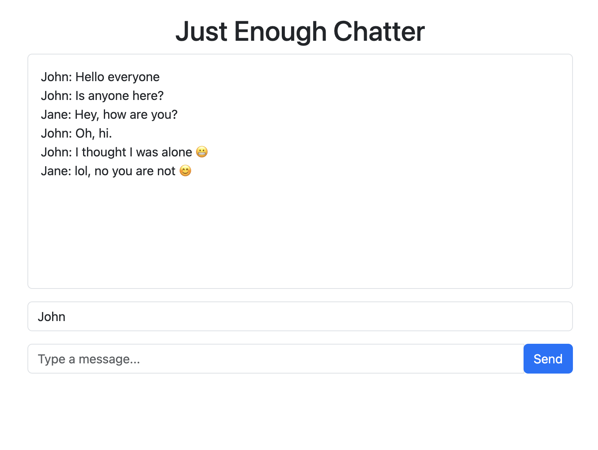

# JE-Chatter
# Real-Time Chat Application

A real-time chat application built using **Spring Boot**, **IntelliJ**, **Java**, **Thymeleaf**, **SockJS**, **Lombok**, and **Spring WebSocket**. This project demonstrates the implementation of a real-time messaging system where multiple users can communicate seamlessly.

---

## Features

- **Real-time messaging** with WebSockets and SockJS.
- **Thymeleaf** for dynamic rendering of web pages.
- **Broadcast messaging**: Messages sent by one user are received by all users subscribed to the chat topic.
- Lightweight and efficient **Spring Boot backend**.
- Easy-to-extend architecture for adding new features.

---

## Technologies Used

- **Spring Boot**: Backend framework for handling requests and managing WebSocket connections.
- **SockJS**: Fallback library for WebSocket support.
- **Thymeleaf**: Server-side rendering for HTML templates.
- **Lombok**: Simplifies boilerplate code.
- **Spring WebSocket**: Handles real-time bi-directional communication between server and clients.

---

## Endpoints

| Method | Endpoint         | Description                                                        |
|--------|------------------|--------------------------------------------------------------------|
| `GET`  | `/chat`          | Serves the chat page for the client.                              |
| `POST` | `/sendMessage`   | Handles incoming messages and broadcasts them to all subscribers. |

---

## Controller Overview

The following controller handles the messaging and routing logic:

```java
@Controller
public class ChatController {

    @MessageMapping("/sendMessage") // Route for client messages
    @SendTo("/topic/messages") // Broadcasts messages to all subscribers
    public ChatMessage sendMessage(ChatMessage message) {
        return message;
    }

    @GetMapping("chat")
    public String chat() {
        return "chat"; // Returns the chat template
    }
} 
```

---

## Project Setup
### Prerequisites

- **Java 21 (or compatible)**
- **Maven (for dependency management)**
- **MySQL (optional, if planning to save chat history)**
- **An IDE like IntelliJ IDEA**

---
## Lombok Setup
To ensure your IDE recognizes Lombok annotations, follow these steps:
### Install the Lombok Plugin:
- **IntelliJ IDEA:** 
1. Go to File > Settings > Plugins.
2. Search for "Lombok" and install it.
- **Eclipse**
1. Go to Help > Eclipse Marketplace.
2. Search for "Lombok" and install it.

---
## Enable Annotation Processing
- **IntelliJ IDEA:**
1. Go to File > Settings > Build, Execution, Deployment > Compiler > Annotation Processors.
2. Enable annotation processing.
- **Eclipse**
1. This is enabled by default.


---
## Screenshots and Screen records

[Chats in implementation](https://drive.google.com/file/d/1U22MYQpVHJsYoY1g-FYbrNQc-9wJ8xuu/view?usp=drive_link)


---

## Future Enhancements
The following features are planned for future versions:
- **User Authentication:** Implement user login and registration.
- **Private Messaging:** Allow users to send direct messages.
- **Chat History:** Save chat logs to a database.
- **Typing Indicators:** Show when a user is typing.
- **Presence Indicators:** Display online/offline status of users.
- **Enhanced UI:** Improve the user interface with modern design elements.


## Contact Me

If you have any questions, suggestions, or feedback regarding this project, feel free to reach out:

- **Email**: iamricharduzor@gmail.com
- **GitHub**: [Your GitHub Profile](https://github.com/EQua-Dev)
- **LinkedIn**: [Your LinkedIn Profile](https://www.linkedin.com/in/richard-uzor/)
- **X (Formerly Twitter)**: [@richard_eQua](https://x.com/richard_eQua)

I am always open to collaboration and discussions about improving the project. Don't hesitate to get in touch!